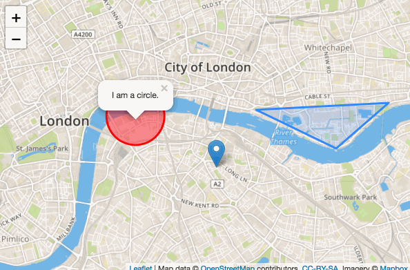
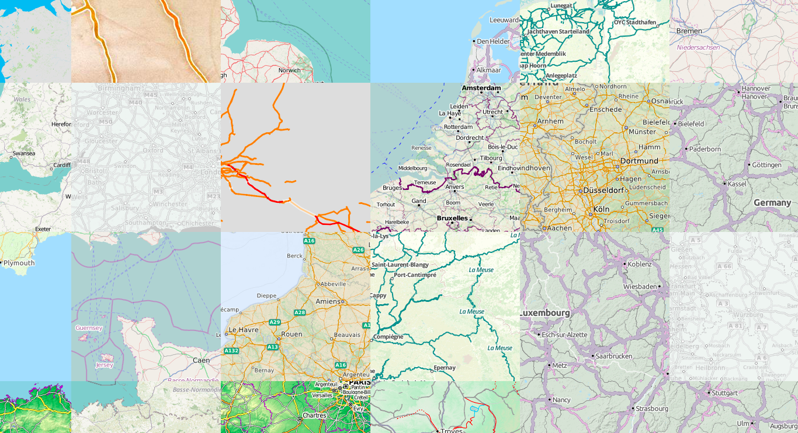
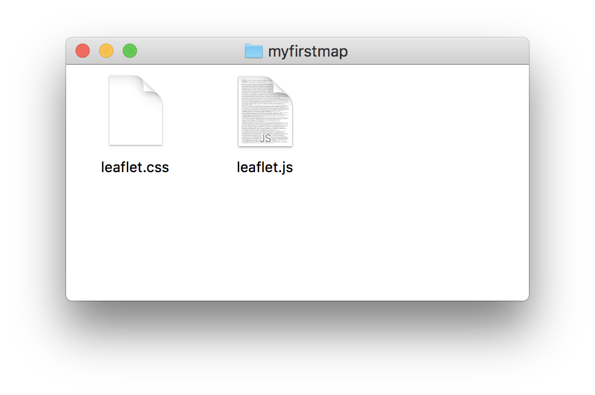
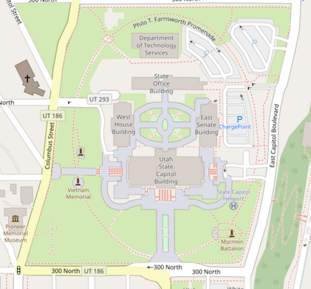

# My First Web Map

--- 

# What is a Web Map?
A map that lives on the internet. 
You can open it in any browser. 
It will let you zoom in and out and pan around
It will let you click on things to give you more information. 



---

# Why make a Web Map?
It is fun and not too hard!
You can make any kind of map you want.



---

# Why use Free and Open tools and data?
You have more control over the end result.
It is free ($) in most cases.
No surprises (changing business models, APIs, terms and conditions..).
No privacy concerns.

---

# What do we need?
Some HTML to show your map and other things on the page.
A bit of JavaScript code, the nuts and bolts of your web map.
Some CSS to add style.

And, of course, map data to show.

Let's worry about that a little later and get started!

--- 

# Step 1. Download Leaflet
Leaflet is an open source library to display and manipulate web maps.
Exactly what we need for our project.
We can get it at leafletjs.com


--- 

# Step 2. Create a place for our project
Things are easier when we keep them organized.
Create a folder called `myfirstmap` on your Desktop.
Copy `leaflet.js` and `leaflet.css` there.




---

# Map Data
Where do we find map data?
OpenStreetMap is the best source for freely accessible map data.
OSM is the wiki of maps. 
Millions of people contribute to it. (And you can, too!)
It is very detailed:



---

# Map Data
It looks like this:
```
<way id="10093393" visible="true" version="14" changeset="54845474" timestamp="2017-12-22T16:56:47Z" user="mvexel" uid="8909">
<nd ref="83026420"/>
<nd ref="83026422"/>
<nd ref="83026424"/>
<nd ref="4184887797"/>
<tag k="highway" v="residential"/>
<tag k="name" v="South 3000 West"/>
<tag k="tiger:cfcc" v="A31"/>
<tag k="tiger:county" v="Davis, UT"/>
<tag k="tiger:name_base" v="3000"/>
<tag k="tiger:name_direction_prefix" v="S"/>
<tag k="tiger:name_direction_suffix" v="W"/>
<tag k="tiger:reviewed" v="no"/>
</way>
```
Eek! How do we turn that into a pretty map?

---

# Map Data
Fortunately for us, we don't have to worry about that right now.
OpenStreetMap's systems turn the data into map images we can use.
Every time someone makes a change, new images are created.
So the map is always up to date.
