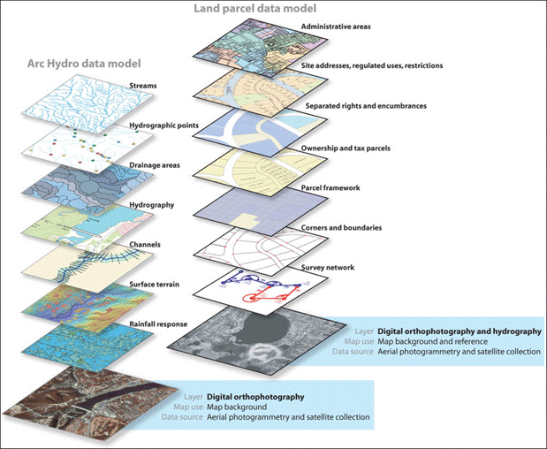

# My First Web Map

--- 

# What is a Web Map?
A map that lives on the internet. 
You can open it in any browser. 
It will let you zoom in and out and pan around
It will let you click on things to give you more information. 


---

# Why make a Web Map?
It is fun and not too hard!
You can make any kind of map you want.


---

# Why use Free and Open tools and data?
You have more control over the end result.
It is free ($) in most cases.
No surprises (changing business models, APIs, terms and conditions..).
No privacy concerns.

---

# What do we need?
Some HTML to show your map and other things on the page.
A bit of JavaScript code, the nuts and bolts of your web map.
Some CSS to add style.

And, of course, map data to show.

Let's worry about that a little later and get started!

--- 

# Step 1. Download Leaflet
Leaflet is an open source library to display and manipulate web maps.
Exactly what we need for our project.
We can get it at leafletjs.com


--- 

# Step 2. Create a place for our project
Things are easier when we keep them organized.
Create a folder called `myfirstmap` on your Desktop.
Unpack your downloaded Leaflet archive.
Copy `leaflet.js` and `leaflet.css` from there to your project folder.


---
# Step 3. Create your page
Next, we need to create a HTML page to show our map.
Let's start with an empty HTML page:

```
<!DOCTYPE html>
<html>
<head>
  <meta charset="utf-8">
  <title>My First Map</title>
</head>
<body>
	
</body>
</html>
```

--- 
# Add Leaflet
Next, let's include the Leaflet style sheet and library:
```
<head>
    <title>My First Map</title>
    <link rel="stylesheet" href="leaflet.css" />
    <script src="leaflet.js"></script>
</head>
```
It is important that we include the stylesheet **before** the JavaScript.

--- 
# Add Content elements
If you open this page in a browser, it is empty. 
We have not added any content yet, just the Leaflet library.
Let's add some content!

```
<body>
  <h1>My First Map</h1>
  <div id="mapid" style="width: 600px; height:400px;">
  </div>
</body>
```
We added a title and an empty `div` container element with of 600x400 pixels called `mapid`.
Leaflet will use this `div` element to put our map.

--- 
# Leaflet Magic
We are now ready to put a map on the page!
This is where Leaflet will do its magic.
Here is what we will do:
1. We create a new Leaflet Map object and 'attach' it to our container
2. We define the settings for our Leaflet Map 
3. We add a map layer to the Leaflet Map

Let's do these things step by step.

---
# Create Map
Add a JavaScript block to the end of the HTML, between `</body>` and `</html>`:
```
<script type="text/javascript">
  var mymap = L.map('mapid');
</script>
```
This initializes a new instance of `Leaflet.Map` and stores it in a JavaScript variable called `mymap`.

--- 
# Map Settings
We need to tell the Map how to behave.
A Leaflet Map has many optional settings.
They define things like controls, zoom levels and behavior, animations.
For now, we will just set the Map's initial `view`.
```
  mymap.setView([40.77, -111.90], 13);
```
This tells `mymap` to set the initial View to center on the coordinate `(40.77, -111.90)`, with zoom level 13.

---
# Map Data
Our Map still does not contain any map data, so it will not show anything.
Leaflet, like other digital map systems, defines map data in **Layers**.



<small>Source: https://researchguides.library.syr.edu/c.php?g=258118&p=1723814</small>

---
# Map Layer
In a digital map, each layer typically contains a specific type of information.
Layers are stacked on top of each other.
The 'bottom' layer 

---
# Map Data
Where do we find map data?
OpenStreetMap is the best source for freely accessible map data.
OSM is the wiki of maps. 
Millions of people contribute to it. (And you can, too!)
It is very detailed:


---

# Map Data
It looks like this:
```
<way id="10093393" visible="true" version="14" changeset="54845474" timestamp="2017-12-22T16:56:47Z" user="mvexel" uid="8909">
<nd ref="83026420"/>
<nd ref="83026422"/>
<nd ref="83026424"/>
<nd ref="4184887797"/>
<tag k="highway" v="residential"/>
<tag k="name" v="South 3000 West"/>
<tag k="tiger:cfcc" v="A31"/>
<tag k="tiger:county" v="Davis, UT"/>
<tag k="tiger:name_base" v="3000"/>
<tag k="tiger:name_direction_prefix" v="S"/>
<tag k="tiger:name_direction_suffix" v="W"/>
<tag k="tiger:reviewed" v="no"/>
</way>
```
Eek! How do we turn that into a pretty map?

---

# Map Data
Fortunately for us, we don't have to worry about that right now.
OpenStreetMap's systems turn the data into map images we can use.
Every time someone makes a change, new images are created.
So the map is always up to date.
